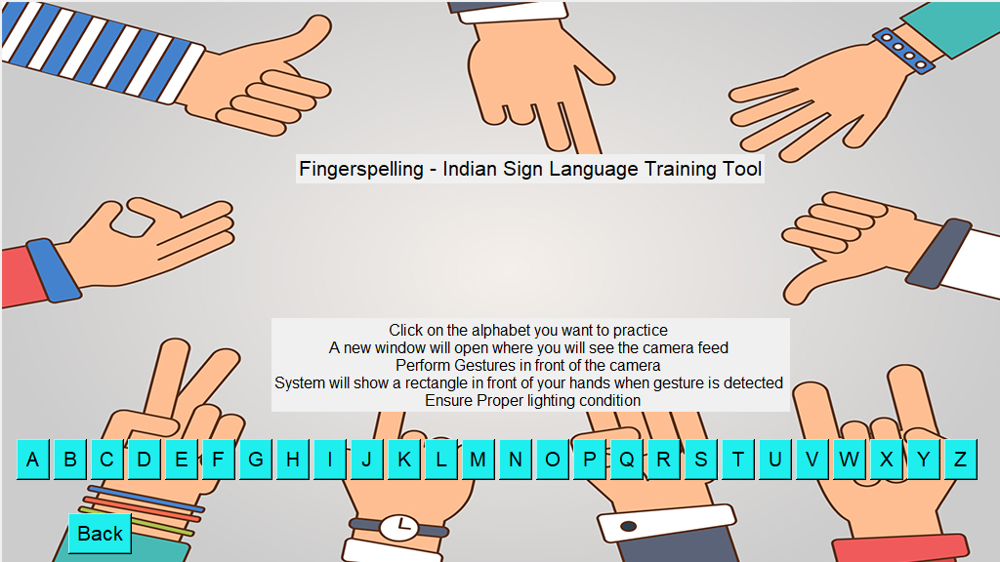
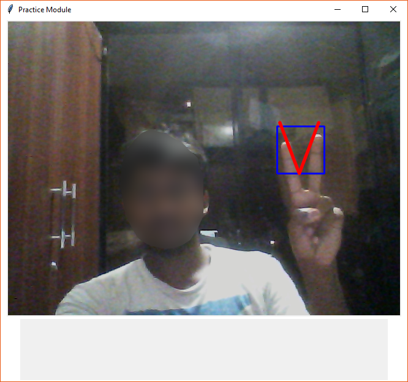
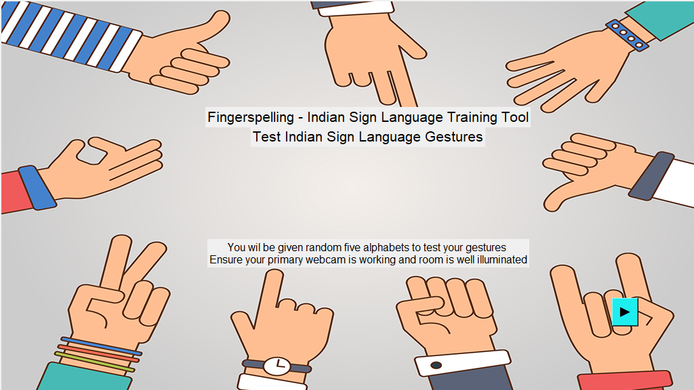
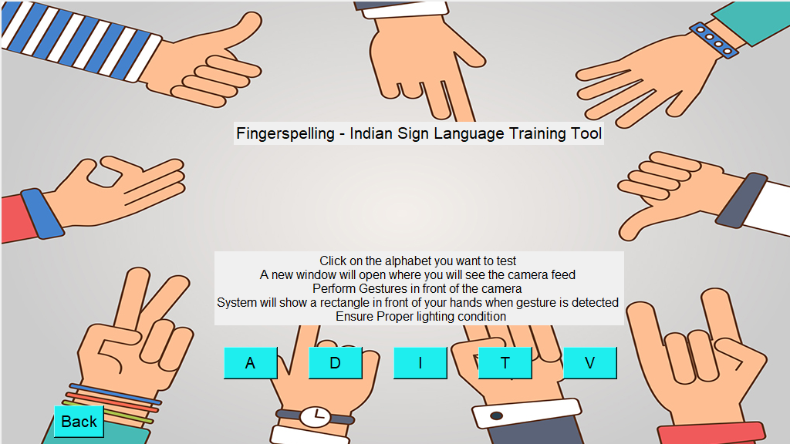
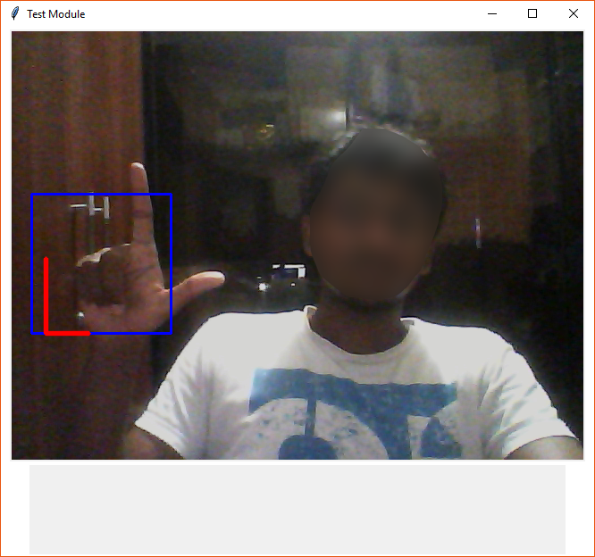

<h1 align = 'center'>Sign Language Tool</h1>

## Introduction
This project helps the disabled people to understand alphabetical input and turns it into an animated sign language (Indian Sign Language)
It also has image processing feeds that will help in translating sign language into English alphabets. The project comprises of three modules: **_Learn, Practice and Test_**. These Modules will help you in learning the basics of the Indian Sign Language.  

You can view the [_Project Report_](http://ekalavya.it.iitb.ac.in/summerinternship2017/nologin_download.html?fileName=Gesture_Based_App_for_Sign_Language.pdf&fileType=report) and the [_Project Presentation_](http://ekalavya.it.iitb.ac.in/summerinternship2017/nologin_download.html?fileName=Gesture_Based_App_for_Sign_Language.pptx&fileType=presentation), IIT Bombay Summer Internship Eklavya 2017.  
  
> This Repo has the Practice and Test Modules of the [Parent Repository](https://github.com/Tejas-Nanaware/Sign-Language-Tool)

## Installation
These modules help you to test the gestures that you have performed using the webcam interface. You will need to install Python3 with TKinter and additional Python packages that are given in the requirements file.
```
You can also use pip to install the requirements as  
pip install -r requirements.txt
```  
To run the app, simply execute Practice.py and Test.py for the respective modules.  

## The Practice and The Test Modules
The Haar Cascade Classifiers are generated for each alphabet which you can retrain by following the instructions in the [Parent Repository](https://github.com/Tejas-Nanaware/Sign-Language-Tool).  
The Haar Cascade Classifiers have been trained using over 2500 samples and for over 10 levels.  
> The GUI is made for a standard display of 1024x576 pixels.  
Proper instructions are provided on screen for both modules.  
### Practice Module
Practice module can be started by running the Practice.py file in the Practice module directory. The GUI starts with an initial screen and the next screen as shown in the figures below.  
  
  
On selecting the alphabet on the screen shown above, a new window will appear showing the webcam feed.  
After performing the gesture correctly, the system will show a rectangle on the hand gesture as shown below.  
  
### Test Module
Test module can be started by running the Test.py file in the Test Module directory. The GUI starts with an initial screen and the next screen as shown in the figures below.  
  
Any five alphabets will be generated randomly. After five seconds, a photo will be taken so that the teacher can grade the gesture as sometimes the system may not generate the desired output so the student should not lose grades in this case.  
  
On selecting the alphabet on the screen shown above, a new window will appear showing the webcam feed.  
After performing the gesture correctly, the system will show a rectangle on the hand gesture as shown below.  
  
